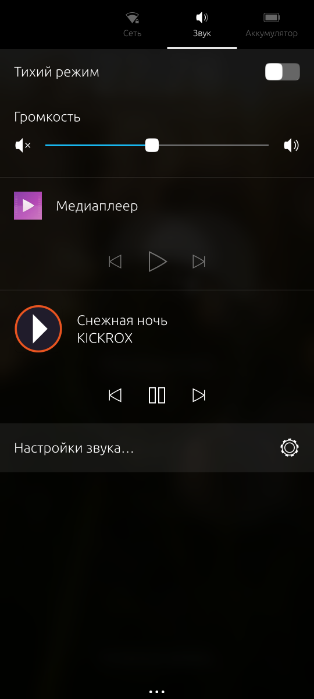

# WayMedia for Ubuntu Touch

Управление медиаплеером Android из контейнера **Waydroid** штатными средствами Ubuntu Touch:
индикатор звука и **экран блокировки**.

Waydroid поднимает целое пользовательское пространство Android, чьи медиа-сессии не видит
Lomiri: MPRIS живёт на session bus хоста, `MediaSession` — внутри контейнера, и между ними
ничего нет. WayMedia закрывает этот разрыв.



## Как это работает

```
Android (Waydroid)            хост (Lomiri)
┌──────────────────┐          ┌───────────────────────────────────────────┐
│ MediaSession     │          │ waymediad (systemd user unit)             │
│  ru.yandex.music │◀── adbd ─┤  dumpsys media_session ──▶ состояние      │
│                  │  :5555   │  cmd media_session dispatch ◀── команды   │
└──────────────────┘          │            │                    ▲        │
                              │            ▼                    │        │
                              │  org.mpris.MediaPlayer2.waymedia │        │
                              │            │                    │        │
                              │            ▼                    │        │
                              │  ayatana-indicator-sound ────────┘        │
                              │      ├── шторка звука                     │
                              │      └── профиль phone_greeter = локскрин │
                              │                                           │
                              │  QML UI ◀── HTTP 127.0.0.1:21980          │
                              └───────────────────────────────────────────┘
```

Ключевые решения, каждое проверено на устройстве (UT 24.04, arm64):

- **Транспорт — adbd контейнера** (`192.168.240.112:5555`) через минимальный ADB-клиент на Go
  (`internal/waydroid/adb.go`): не нужен ни root, ни `waydroid shell`, ни резидентный
  adb-сервер, а соединение переиспользуется между опросами.
- **Индикатор находит плеер только по MPRIS-свойству `DesktopEntry`**, приводя его к
  `<id>.desktop` и резолвя файл через GLib. Не нашёл файл — пишет `unable to find application`
  и выбрасывает плеер целиком. Поэтому демон сам генерирует
  `~/.local/share/applications/waymedia-waydroid.desktop` со стабильным именем и абсолютным
  `Exec=lomiri-app-launch …` (click-хук не подходит: его desktop id содержит версию пакета,
  а `Exec` относительный и резолвится только через `Path=`).
- **Запись в gsettings `interested-media-players` не нужна**: индикатор дописывает туда плеер
  сам при появлении bus name. Проверено удалением записи — плеер остаётся в greeter-меню.
- **Демон живёт systemd *user*-юнитом**, а не форком из приложения: Lomiri усыпляет и затем
  реапит cgroup фонового приложения, а мост должен работать при заблокированном экране.
  Тот же юнит поднимает демон после перезагрузки без root и без rw-rootfs.
- **`CanRaise=true`**, иначе индикатор рисует строку плеера неактивной.

## Ограничения (следствия `dumpsys`)

`dumpsys media_session` — единственный доступный из shell вид на воспроизведение, поэтому:

- **Нет обложек.** Album art в дампе отсутствует. Без `mpris:artUrl` Lomiri рисует строку трека
  вообще без картинки, поэтому публикуется иконка пакета — чтобы источник воспроизведения был
  опознаваем.
- **Нет длительности трека** → `mpris:length` не публикуется, прогресс-бара нет.
- **Имя приложения** берётся из `nonLocalizedLabel` (`dumpsys package`); локализованные лейблы
  лежат в ресурсах APK и из shell недоступны, поэтому для части плееров показывается
  производное от имени пакета (`ru.yandex.music` → `Music`).
- **Запятая в названии трека.** `MediaMetadata.toString()` плющит описание в одну строку
  `description=Title, Artist, Album`; разбор трактует последние два поля как артиста и альбом —
  наименее травматичный вариант, зафиксирован тестом.
- **Команды адаптируются под сессию.** Плееры на androidx.media3 объявляют `ACTION_PLAY_PAUSE`
  без `ACTION_PLAY` (Яндекс Музыка: `actions=524283`) и вольны игнорировать не объявленную
  медиа-клавишу. `Play`/`Pause` в таком случае переводятся в toggle — и только когда toggle
  попадает в запрошенное состояние, иначе команда отбрасывается как избыточная.

## Сборка и установка

`click` под macOS нет, поэтому дерево пакета собирается локально, упаковывается **на телефоне**
и устанавливается оттуда же. На хосте с несколькими adb-устройствами обязателен `ADB_SERIAL`.

```sh
ADB_SERIAL=<serial> make click     # собрать .click в build/
ADB_SERIAL=<serial> make deploy    # собрать, установить, перезапустить демон
ADB_SERIAL=<serial> make logs      # journal приложения + демона
make test                          # go test ./...
```

Пароль sudo для установки — переменная `WAYMEDIA_SUDO_PASS`.

Первый запуск приложения (тап по иконке — из adb приложение не поднять, нет trust-session)
устанавливает `~/.config/systemd/user/waymediad.service` и включает его.

## HTTP API демона

Только loopback, `127.0.0.1:21980`; это единственный канал между QML и демоном.

| Метод | Путь | Назначение |
|---|---|---|
| `GET` | `/api/status` | состояние Waydroid, моста, текущего трека и настроек |
| `GET` | `/api/health` | живость |
| `POST` | `/api/cmd` | `{"action":"play\|pause\|play-pause\|next\|previous\|stop"}` |
| `POST` | `/api/settings` | любое подмножество `{"enabled","poll_ms","idle_poll_ms"}` |

Неизвестное действие → 400; недоступный контейнер → 503. Настройки применяются синхронно:
ответ уже отражает новое состояние моста.

## Структура

```
backend/cmd/waymediad      демон
backend/internal/waydroid  ADB-клиент контейнера, состояние сессии Waydroid
backend/internal/media     парсер dumpsys media_session, опрос, диспатч команд
backend/internal/mpris     MPRIS2-сервер на session bus
backend/internal/indicator генерация desktop-файла для индикатора звука
backend/internal/clickapp  распознавание click-пакета (версия, app id, иконка)
backend/internal/api       локальный HTTP API
backend/internal/config    настройки на диске
qml/                       интерфейс (QtQuick 2.4 + Ubuntu.Components 1.3)
click/                     manifest, apparmor, desktop, run.sh, systemd user unit
scripts/                   сборка на устройстве, деплой, логи, генератор иконки
```

## Диагностика

```sh
# видит ли индикатор плеер и что он покажет на локскрине
adb shell "DBUS_SESSION_BUS_ADDRESS=unix:path=/run/user/32011/bus \
  gdbus call --session --dest org.ayatana.indicator.sound \
  --object-path /org/ayatana/indicator/sound \
  --method org.gtk.Actions.Describe waymedia-waydroid.desktop.greeter"

# меню профиля экрана блокировки
adb shell "DBUS_SESSION_BUS_ADDRESS=unix:path=/run/user/32011/bus \
  gdbus call --session --dest org.ayatana.indicator.sound \
  --object-path /org/ayatana/indicator/sound/phone_greeter \
  --method org.gtk.Menus.Start '[0,1,2,3]'"

# состояние моста
adb shell 'wget -qO- http://127.0.0.1:21980/api/status'
```

`scripts/inject-touch.py` — разовый инструмент верификации: инжектирует свайп/тап в
`/dev/input` (пользователь `phablet` входит в группу `android_input`), чтобы открыть шторку
индикаторов и снять экран блокировки, когда из adb это сделать нельзя. В рантайм-путь
приложения не входит.

## Лицензия

GPL-3.0.
